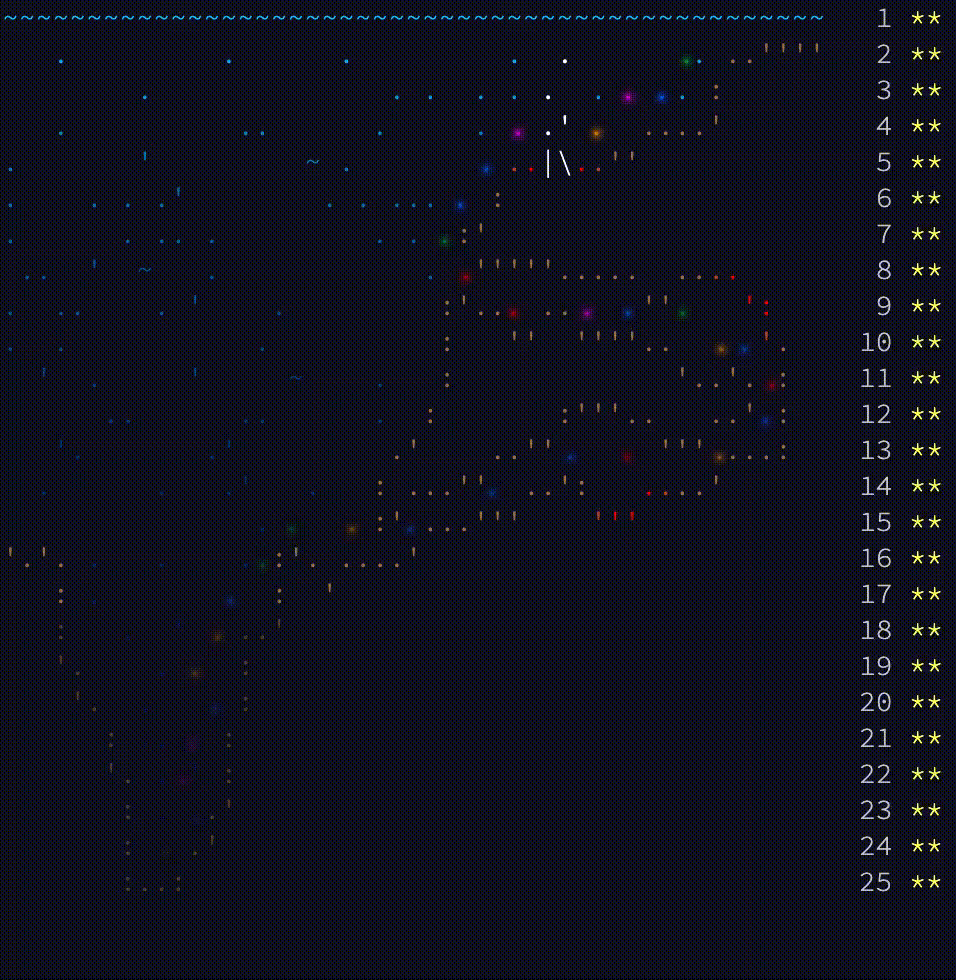

## AoC 2021 Summary Table

<kbd>
    
</kbd>

 
 

| Day | Name | Stars | Code | Part 1 Time (ms) | Part 2 Time (ms) |
|-:|-|-|-|-|-|
| 1 | [Sonar Sweep](https://adventofcode.com/2021/day/1) | ⭐⭐ | [01](Solutions.ipynb) | 6 | 6 |
| 2 | [Dive!](https://adventofcode.com/2021/day/2) | ⭐⭐ | [02](Solutions.ipynb) | 174 | 174 |
| 3 | [Binary Diagnostic](https://adventofcode.com/2021/day/3) | ⭐⭐ | [03](Solutions.ipynb) | 10 | 21 |
| 4 | [Giant Squid](https://adventofcode.com/2021/day/4) | ⭐⭐ | [04](Solutions.ipynb) | 21 | 21 |
| 5 | [Hydrothermal Venture](https://adventofcode.com/2021/day/5) | ⭐⭐ | [05](Solutions.ipynb) | 240 | 133 |
| 6 | [Lanternfish](https://adventofcode.com/2021/day/6) | ⭐⭐ | [06](Solutions.ipynb) | 5 | 5 |
| 7 | [The Treachery of Whales](https://adventofcode.com/2021/day/7) | ⭐⭐ | [07](Solutions.ipynb) | 238 | 491 |
| 8 | [Seven Segment Search](https://adventofcode.com/2021/day/8) | ⭐⭐ | [08](Solutions.ipynb) | 12 | 13 |
| 9 | [Smoke Basin](https://adventofcode.com/2021/day/9) | ⭐⭐ | [09](Solutions.ipynb) | 54 | 187 |
| 10 | [Syntax Scoring](https://adventofcode.com/2021/day/10) | ⭐⭐ | [10](Solutions.ipynb) | 3 | 3 |
| 11 | [Dumbo Octopus](https://adventofcode.com/2021/day/11) | ⭐⭐ | [11](Solutions.ipynb) | 55 | 55 |
| 12 | [Passage Pathing](https://adventofcode.com/2021/day/12) | ⭐⭐ | [12](Solutions.ipynb) | 24 | 324 |
| 13 | [Transparent Origami](https://adventofcode.com/2021/day/13) | ⭐⭐ | [13](Solutions.ipynb) | 4 | 14 |
| 14 | [Extended Polymerization](https://adventofcode.com/2021/day/14) | ⭐⭐ | [14](Solutions.ipynb) | 4 | 7 |
| 15 | [Chiton](https://adventofcode.com/2021/day/15) | ⭐⭐ | [15](Solutions.ipynb) | 69 | 1139 |
| 16 | [Packet Decoder](https://adventofcode.com/2021/day/16) | ⭐⭐ | [16](Solutions.ipynb) | 12 | 13 |
| 17 | [Trick Shot](https://adventofcode.com/2021/day/17) | ⭐⭐ | [17](Solutions.ipynb) | 2 | 535 |
| 18 | [Snailfish](https://adventofcode.com/2021/day/18) | ⭐⭐ | [18](Solutions.ipynb) | 156 | 2509 |
| 19 | [Beacon Scanner](https://adventofcode.com/2021/day/19) | ⭐⭐ | [19](Solutions.ipynb) | 70525 | 70527 |
| 20 | [Trench Map](https://adventofcode.com/2021/day/20) | ⭐⭐ | [20](Solutions.ipynb) | 114 | 1977 |
| 21 | [Dirac Dice](https://adventofcode.com/2021/day/21) | ⭐⭐ | [21](Solutions.ipynb) | 2 | 78 |
| 22 | [Reactor Reboot](https://adventofcode.com/2021/day/22) | ⭐⭐ | [22](Solutions.ipynb) | 280407 | 280500 |
| 23 | [Amphipod](https://adventofcode.com/2021/day/23) | ⭐⭐ | [23](Solutions.ipynb) | 20888 | 20900 |
| 24 | [Arithmetic Logic Unit](https://adventofcode.com/2021/day/24) | ⭐⭐ | [24](Solutions.ipynb) | 3 | 3 |
| 25 | [Sea Cucumber](https://adventofcode.com/2021/day/25) | ⭐⭐ | [25](Solutions.ipynb) | 103988 | / |

