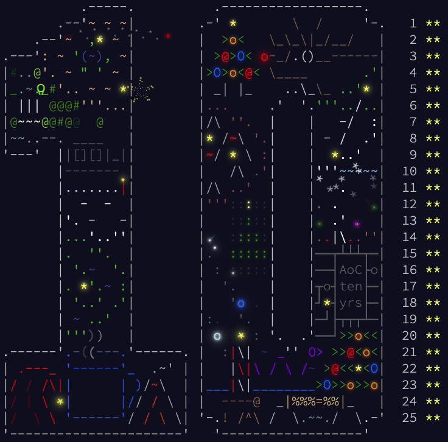

## AoC 2024 Summary Table

<kbd>

</kbd>
 
 

| Day | Stars | Code |
|-----|-------|------|
| 1   | ⭐⭐    | [01.py](src/01.py) |
| 2   | ⭐⭐    | [02.py](src/02.py) |
| 3   | ⭐⭐    | [03.py](src/03.py) |
| 4   | ⭐⭐    | [04.py](src/04.py) |
| 5   | ⭐⭐    | [05.py](src/05.py) |
| 6   | ⭐⭐    | [06.py](src/06.py) |
| 7   | ⭐⭐    | [07.py](src/07.py) |
| 8   | ⭐⭐    | [08.py](src/08.py) |
| 9   | ⭐⭐    | [09.py](src/09.py) |
| 10  | ⭐⭐    | [10.py](src/10.py) |
| 11  | ⭐⭐    | [11.py](src/11.py) |
| 12  | ⭐⭐    | [12.py](src/12.py) |
| 13  | ⭐⭐    | [13.py](src/13.py) |
| 14  | ⭐⭐    | [14.py](src/14.py) |
| 15  | ⭐⭐    | [15.py](src/15.py) |
| 16  | ⭐⭐    | [16.py](src/16.py) |
| 17  | ⭐⭐    | [17.py](src/17.py) |
| 18  | ⭐⭐    | [18.py](src/18.py) |
| 19  | ⭐⭐    | [19.py](src/19.py) |
| 20  | ⭐⭐    | [20.py](src/20.py) |
| 21  | ⭐⭐    | [21.py](src/21.py) |
| 22  | ⭐⭐    | [22.py](src/22.py) |
| 23  | ⭐⭐    | [23.py](src/23.py) |
| 24  | ⭐⭐    | [24.py](src/24.py) |
| 25  | ⭐⭐    | [25.py](src/25.py) |

