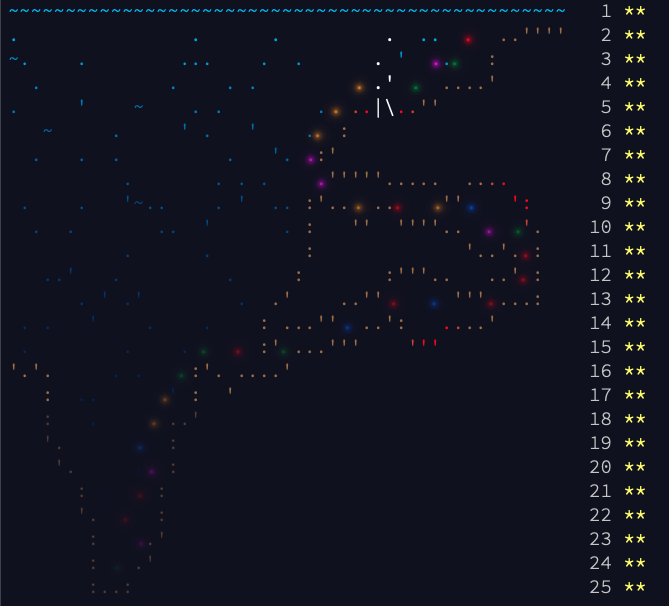

[](https://www.python.org/)

# 🎄 Advent-of-Code 🎅
Solutions to AoC ([link](https://adventofcode.com/2022/about)) 2021 and 2022 problems in Python 3.10.

In total I have currently 50 ⭐. I completed the AoC 2021. In this repo you will find the 2021 solutions inside a jupyter notebook and the ones for the 2022 in python script.

## Installation

Create the environment from the environment.
yml file:

```bash
> conda env create -f environment.yml
```

## Usage

Move to the `2022` folder. To run a single solution:

```bash
> python src/<DAY>.py
```

At the end is created a `log` file inside the `2022` folder. It will contains all solution with both part 1 and 2 and the elapsed time for each day.


## ⭐ AoC completed over the years ⭐ 

### **2021**




## License

Distributed under the MIT License. See [LICENSE](./LICENSE) for more information.


## Contact

Guglielmo Cerri - cerriguglielmo@gmail.com

Project Link: [https://github.com/GuglielmoCerri/Advent-of-Code](https://github.com/GuglielmoCerri/Advent-of-Code)


